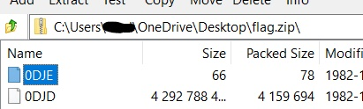
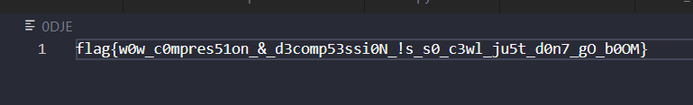

# Zabomb
## Description

> You received a suspicious file from the k3rn3l4rmy hacking group, the title says ‘Not a Zip Bomb, Please Open’, you decide NOT to open it and instead try to reverse it.

> It is recommended that you do NOT open this, it will fill your entire disk.

## Solution

Dont try to unzip this file, it can fill out your disk.

Check it out the file by some application such as `7z`, it has a strange file. Cause other files is medium or very large 



Just extract this file and open it



The flag was captured 🎉🎉

```
Flag is : flag{w0w_c0mpres51on_&_d3comp53ssi0N_!s_s0_c3wl_ju5t_d0n7_gO_b0OM}
```
